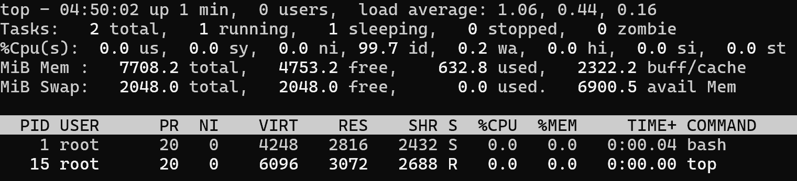
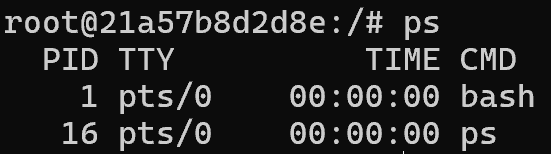
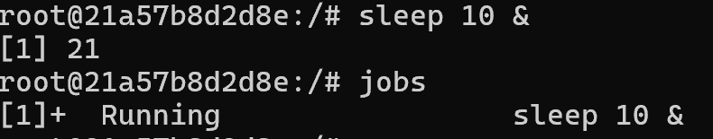

# 리눅스 명령어 top, ps, jobs, kill
## 오픈소스sw개론 03분반 20212994 김건희

## 1. top 
윈도우의 작업 관리자와 유사하게, 시스템의 리소스(CPU, 메모리)와 프로세스 상태를 **실시간으로 갱신**하며 보여주는 도구이다.

- **사용법:** `top [옵션]`
- **주요 포인트:** 상단의 시스템 요약(Uptime, Load Average)과 하단의 프로세스 목록을 한눈에 파악할 수 있다.

### 주요 옵션
| 옵션 | 기능 요약 |
| :--- | :--- |
| `-d [초]` | 화면 갱신 주기를 설정한다.  |
| `-n [숫자]` | 지정한 횟수만큼만 화면을 갱신하고 종료한다. |
| `-p [PID]` | 특정 프로세스 하나만 집중적으로 모니터링한다. |

### 실행화면

---

## 2. ps 
'Process Status'의 약자로, 실시간으로 상태를 보여주는 `top`과 달리 **명령어를 입력한 순간의 프로세스 상태**를 출력한다.

- **사용법:** `ps [옵션]`
- **주요 포인트:** 내가 실행한 명령어의 PID를 찾거나, 특정 유저의 프로세스를 확인할 때 사용한다.

### 주요 옵션
| 옵션 | 기능 요약 |
| :--- | :--- |
| `-A` | 시스템의 모든 프로세스를 출력한다. |
| `-u [유저명]` | 특정 사용자가 실행시킨 프로세스만 필터링한다. |
| `-ef --forest` | 프로세스의 부모-자식 관계를 트리 구조로 시각화한다. |

### 실행화면

---

## 3. jobs 
현재 터미널 세션에서 실행 중인 **백그라운드(Background)** 및 포그라운드 작업들을 관리한다.

- **사용법:** `jobs [옵션]`
- **상태 코드 의미:**
    - `Running`: 작업이 실행 중이다.
    - `Stopped`: `Ctrl+Z`와 같은 작업으로 인해 잠시 멈춘 상태이다.
    - `Done`: 작업이 정상적으로 종료되었다.

### 실행화면

---

## 4. kill (프로세스 종료 신호)
특정 프로세스에 **시그널**을 보내 작업을 제어하거나 강제로 종료시킬 때 사용한다.

- **사용법:** `kill [옵션] [PID]`
- **기본 동작:** 옵션 없이 사용 시 종료 신호를 보낸다.

### 주요 옵션
| 옵션 | 기능 요약 |
| :--- | :--- |
| `-s` | 특정 시그널을 지정해서 전송한다. |
| `-l` | 사용 가능한 모든 시그널의 이름과 번호 목록을 출력한다. |
| `-a` | 현재 내 권한으로 실행된 모든 프로세스를 대상으로 한다. |
| `-q` | 즉시 신호를 보내지 않고 대기열(Queue)에 등록한다. |
